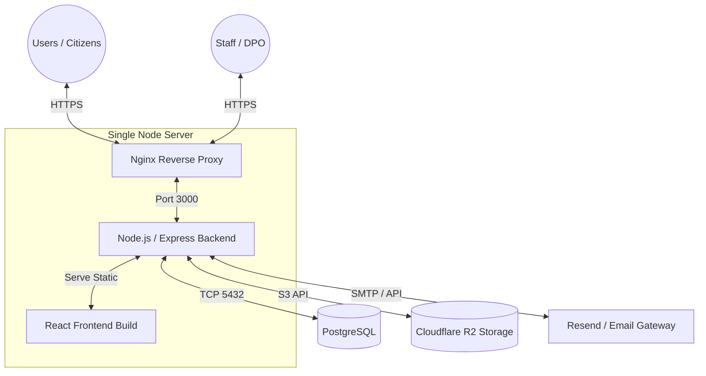

# Blueprint: PDPA Compliance Management System
**Version:** V1.1.0-beta  
**Last Updated:** 28 August 2026

เอกสารฉบับนี้รวบรวมโครงสร้างสถาปัตยกรรม (Architecture) และองค์ประกอบทั้งหมดของระบบ PDPA เพื่อใช้เป็นแหล่งอ้างอิง (Source of Truth) ในการพัฒนาและบำรุงรักษาระบบในอนาคต

---

## 1. System Architecture & Tech Stack

ระบบเป็นสถาปัตยกรรมแบบ **Single-Node Monolithic** (รัน Frontend และ Backend ภายในเซิร์ฟเวอร์เดียวกัน) 

- **Frontend (หน้าบ้าน):** React.js + TypeScript (`src/App.tsx`) ตกแต่ง UI ด้วย TailwindCSS รันแบบ SPA (Single Page Application)
- **Backend (หลังบ้าน):** Node.js + Express.js (`server.js`, `routes/`) ทำหน้าที่เสิร์ฟไฟล์ Frontend และให้บริการ REST API
- **Database (ฐานข้อมูล):** PostgreSQL จัดเก็บข้อมูลผู้ใช้งาน, คำขอ (Requests), และประวัติการตรวจสอบ (Audit Logs)
- **Storage (พื้นที่เก็บไฟล์):** Cloudflare R2 (S3-compatible) ใช้สำหรับเก็บไฟล์แนบ, รูปภาพ, และเอกสารที่ถูกปิดบังข้อมูล (Redacted)
- **Process Manager:** PM2 (`pdpa-req-system`) ใช้จัดการและรัน Node.js ตลอดเวลา

---

## 2. Server Environments (สภาพแวดล้อมการทำงาน)

ระบบแบ่งออกเป็น 2 เซิร์ฟเวอร์หลัก:

1. **Production Server (ใช้งานจริง)**
   - **IP:** `119.59.124.169`
   - **Branch ที่ผูกไว้:** `main`
2. **Sandbox Server (ทดสอบ)**
   - **IP:** `119.59.102.26`
   - **Branch ที่ผูกไว้:** `sandbox-single-node`

*(หมายเหตุ: รหัสผ่าน SSH Root ของทั้งสองเครื่อง ถูกจัดการไว้นอกระบบ Git เพื่อความปลอดภัย)*

---

## 3. Core Modules (โมดูลการทำงานหลัก)

### 3.1 Public Portal (ฝั่งประชาชน)
- **Data Subject Rights (DSR):** ฟอร์มยื่นคำขอใช้สิทธิ 9 ประเภท โดยระบบจะผูกฐานอ้างอิงกฎหมาย (Legal Basis) ให้ตรงตามสิทธิโดยอัตโนมัติ (เช่น สิทธิขอให้ลบ = มาตรา 33)
- **Tracking & Verification:** ประชาชนสามารถติดตามสถานะคำขอ โดยยืนยันตัวตนผ่าน OTP ที่ส่งเข้าอีเมล
- **Message Board:** ช่องทางแชทคุยกับเจ้าหน้าที่ (ยังคงเปิดให้พิมพ์โต้ตอบได้ แม้คำขอจะถูกปิดงานไปแล้ว)

### 3.2 Internal Portal (ฝั่งเจ้าหน้าที่)
ระบบมีการแบ่ง Role ผู้ใช้งานชัดเจน: `intake` (รับเรื่อง), `dpo` (เจ้าหน้าที่คุ้มครองข้อมูล), `owner` (เจ้าของข้อมูล), `approver` (ผู้บริหาร/CEO), `admin`
- **Workflow Pipeline:** รองรับสถานะ Received -> Documents Verified -> DPO Review -> Approval Pending -> Closed/Rejected
- **Redaction Tool:** เครื่องมือขีดฆ่า/ปกปิดข้อมูลสำคัญ (Blackout) บนรูปภาพหรือเอกสาร PDF บนหน้าเว็บก่อนทำการบันทึก
- **Watermarking:** ระบบประทับลายน้ำลงบนเอกสารก่อนส่งออก
- **SLA Management:** คำนวณระยะเวลาเส้นตาย (Deadline) ตามเงื่อนไขของแต่ละสถานะ

---

## 4. Workflows & Automations (ระบบอัตโนมัติ)

### 4.1 Email Notifications (แจ้งเตือนอีเมล)
- **ไฟล์ควบคุม:** `services/email.service.js`
- **ผู้ให้บริการ:** รองรับทั้ง `Resend` API และ SMTP ทั่วไป
- **Trigger Points (จุดที่กระตุ้นให้ส่งอีเมล):**
  - ประชาชนยื่นคำขอใหม่ (`CREATE`)
  - ขอรหัส OTP (`OTP`)
  - มีการเปลี่ยนแปลงสถานะ Workflow (`STATUS_CHANGE`) เช่น DPO ส่งเรื่องให้ CEO
  - มีข้อความใหม่ใน Message Board (`NEW_MESSAGE` / `STAFF_REPLY`)

### 4.2 Auto Deploy (GitHub Actions)
- **ไฟล์ควบคุม:** `.github/workflows/deploy.yml`
- **กระบวนการ:** เมื่อมีการ Push หรือ Merge โค้ดเข้า branch `main` GitHub จะ SSH เข้าไปที่ Production Server -> ดึงโค้ดล่าสุด (`git fetch`) -> ติดตั้ง Dependencies (`npm install`) -> Build React (`npm run build`) -> รีสตาร์ทระบบ (`pm2 reload`)
- **Secrets:** ใช้ `SSH_PASSWORD`, `SSH_HOST`, `SSH_USERNAME` จากการตั้งค่าใน GitHub Secrets

---

## 5. Security Implementations (ระบบความปลอดภัย)

- **Fail2Ban:** ติดตั้งทั้งบน Prod และ Sandbox คอยตรวจจับและแบน IP ที่พยายามสุ่มรหัสผ่าน SSH (Port 22) เกิน 5 ครั้ง
- **Field-Level Permissions:** (`middleware/fieldPermissions.js`) ระบบกรองข้อมูลก่อนส่งกลับไปหา Frontend จะลบฟิลด์ที่ประชาชนไม่ควรเห็นออกเสมอ
- **Immutability on Close:** ป้องกันการกดปุ่มบันทึก/แก้ไขเอกสาร ภายในระบบของเจ้าหน้าที่ หากสถานะคำขอนั้นถูก `Closed` ไปแล้ว

---

## 6. Directory Structure (โครงสร้างโค้ดที่สำคัญ)

* `src/App.tsx` - ไฟล์หลักของ Frontend รวม UI เกือบทั้งหมด
* `src/types.ts` - กำหนด Type (TypeScript) ที่สำคัญเช่น `RequestStatus`, `requestType`
* `src/db.ts` - ตัวเชื่อมต่อระหว่าง Frontend และ Backend API
* `server.js` - ไฟล์หลักของ Backend
* `routes/public.routes.js` - API ฝั่งประชาชน และ OTP
* `routes/requests.routes.js` - API ฝั่งเจ้าหน้าที่ (อัปเดตสถานะ, แนบไฟล์)
* `services/` - โลจิกหลังบ้าน (อีเมล, ไฟล์, ลายน้ำ, SLA)
* `*.cjs` - สคริปต์ Utility ทั่วไปสำหรับจัดการเซิร์ฟเวอร์ (ห้ามใส่รหัสผ่านในไฟล์เหล่านี้)
